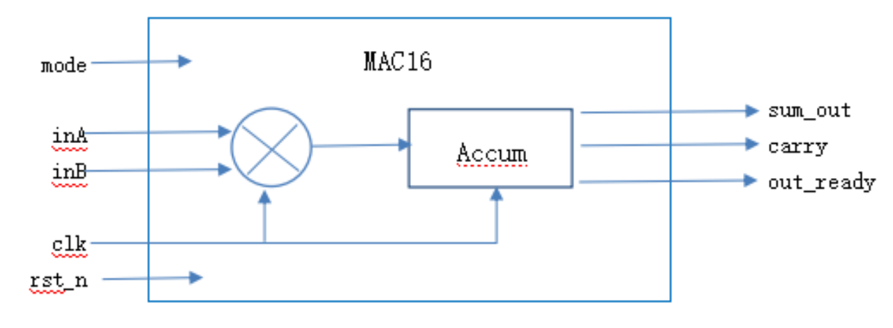

“华大九天”企业命题

一、题目名称：基于全流程国产数字EDA系统的MAC16芯片设计

二、参赛组别：A组、B组

三、赛题介绍：

乘积累加运算（Multiply Accumulate, MAC）是各类CPU, DSP,AI等芯片中用于实现乘法与累加合并操作的常用模块。本题要求设计一款55nm的输入16位、输出24位的串行乘积累加运算器MAC16数字芯片，其主体RTL电路mac16.v和测试电路testbench需自行开发。可参考以下架构：

1. Pin信息：

(1) inA，inB：输入16b串行信号，输入1Gbps、MSB先入，由clk上升沿驱动采样。

(2) sum_out：输出24b串行信号，输出1Gbps、MSB先出，由clk上升沿驱动输出，无数据输出时回0电平。

(3) carry：溢出进位信号，当sum_out溢出后置1，默认0；一旦置1后需被clr或rst_n信号清除；

(4) out_ready: sum_out正在输出时置1，无数据输出时为0；

(5) clk：1GHz主频，上升沿有效，在电路不复位状态时，clk上升沿采样16b的inA和inB串行数据，输入内部锁存器，完成乘法及累加运算，并将运算结果更新至sum_out进行串行输出。从输入串行数据完全采样完、至开始输出串行数据的时间差不超过5个clk周期。

(6) rst_n:电路复位信号，低电平时复位，整个电路不工作，清空所有内部锁存器和所有输出；

(7) mode：选择模式：为0时，输出当前乘积和上一状态乘积之和；为1时，进行全部状态乘积累加的输出。注：mode切换时，清空所有内部锁存器和所有输出。

2. 待测试情况说明：

需分别测试以下3种组合，每种组合输入6组数，建议分别写3个testbench，也可在同1个testbench中轮流实现。

| inA（十进制）              | inB（十进制）             | mode                 |
| --------------------- | -------------------- | -------------------- |
| 2，8，14，116,1546,20698 | 6，30，71,828，1152,728 | 0                    |
| 2，8，14，116,1546,20698 | 6，30，71,828，1152,728 | 1                    |
| 2，8，14，116,1546,20698 | 6，30，71,828，1152,728 | 0->1（在组14&71输入完之后切换） |

3. 每个测试电路的时序过程说明：

clk时钟始终输入1GHz信号；

一开始时rst_n=0,rst_n在2个clk周期后置高并一直保持下去；

随后从inA，inB串行输入6组数据，每组之间可以无间隔也可以有间隔，间隔时间差不超过5个clk周期。

输出信号sum_out,carry和out_ready依以上描述进行输出，测试仿真时间需覆盖全部数据输出过程。

整个过程中，testbench调用mac16.v模块，并自行进行相同逻辑的乘加计算，比较输出数据，只要有一组数据不符合则在log中打印 Simulation Failed，全部6组数据均比较正确打印Simulation Passed。

四、工作条件

1. 采用浙江创芯55nm的工艺PDK和标准单元库；

2. 以下指标工作需要在3个PVT corner下均满足：TT/1.2V/27℃/RCTyp，SS/1.08V/125℃/RCWorst，和FF/1.32V/-40℃/RCBest。

五、作品提交要求

1. 需要提交RTL编写和仿真、逻辑综合、形式验证、布局布线、物理验证直至静态时序分析的整个过程中每个阶段的全部设计数据，及相关重要过程资料（比如log文本等）；

2. 需要提交Word版设计报告，详细阐述设计思路和设计过程、各EDA工具运行结果。

六、指标要求及评分标准

以下共120分，另有加分30分：

1. 完成RTL的编写和仿真、逻辑综合、形式验证、布局布线、物理验证、静态时序分析的整个过程，提交以下每个阶段的全部设计数据（10分）；

2. MAC16芯片为串行输入、串行输出，在1G工作频率下，所有testbench的前仿真输出波形逻辑正确，且所有log汇报“Simulation Passed”（30分）；

3. 逻辑综合汇报结果正确、且汇报Total Power≤300uW（10分）；

4. 形式验证（综合前后一致性对比）结果汇报正确（5分）；

5. 布局布线汇报连接正确（5分），且3个PVT corner的setup & hold slack在1GHz工作频率下均通过，如有一个不通过扣2分（12分）；

6. 物理验证LVS通过（7分）、并获得3个PVT corner的SPEF文件（3分）；

7. 静态时序分析汇报3个PVT corner的setup & hold slack在1GHz工作频率下均通过，如有一个不通过扣3分（18分）；

8. 总面积≤90um * 90um（最后流片DIE面积100um * 100um，需留有顶层拼MPW的空间），且金属层最多使用到M1~M5 (5分)；

9. 提供Word版设计报告，详细阐述设计思路和设计过程、各EDA工具运行结果（15分）；

10. 加分项（共30分）：

(1) 其他指标均达标情况下，逻辑综合汇报Total Power≤100uW（12分）

(2) 其他指标均达标情况下，静态时序分析汇报3个PVT corner的setup & hold slack在1.5GHz工作频率下均能通过（18分）。