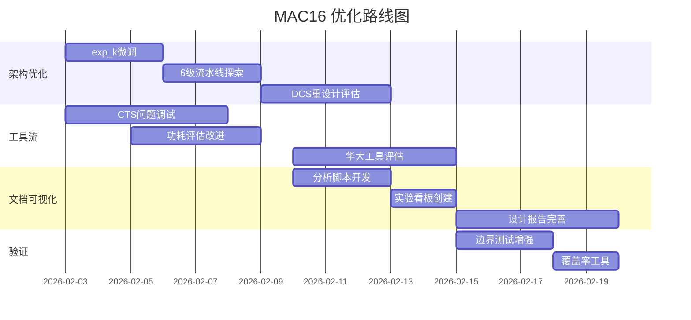

# MAC16 芯片设计优化路线图 (2026-02-02)

**目标**：进一步PPA优化，尤其是高温SS Corner及1.5GHz目标达成  
**当前最佳方案**：exp_k (5级流水线) @ TT Corner 1154MHz

---

## 目录

1. [当前实验架构总结](#1-当前实验架构总结)
2. [下一步架构探索方向](#2-下一步架构探索方向)
3. [物理极限与赛题评估](#3-物理极限与赛题评估)
4. [未完成工具流完善计划](#4-未完成工具流完善计划)
5. [综合结果可视化与分析增强](#5-综合结果可视化与分析增强)
6. [其他考虑事项](#6-其他考虑事项)

---

## 1. 当前实验架构总结

### 1.1 实验架构对比表

| 实验 | 乘法器架构 | 流水线级数 | 累加方式 | 主要优化点 | TT频率 | SS频率 | 面积 |
|------|-----------|-----------|---------|------------|--------|--------|------|
| **baseline** | 行为级 `*` | 2 | 外部 | - | ~700MHz | - | ~4800µm² |
| **exp_a** | 3级流水 + 4×8x8 | 3 | 外部 | 操作数隔离 | ~850MHz | - | ~5526µm² |
| **exp_b** | Radix-4 Booth + CSA | 3 | 外部 | Booth编码 | ~848MHz | - | ~5598µm² |
| **exp_c** | 4级深度流水 | 4 | 外部 | 更深流水线 | ~907MHz | - | ~5820µm² |
| **exp_d** | Radix-4 Booth + 4:2压缩器 | 3 | 外部 | 结构化Wallace Tree | **1033MHz** | ~555MHz | 5659µm² |
| **exp_e** | DCS融合MAC (2级) | 2 | 内部DCS | Double Carry-Save累加 | 824MHz | - | 5212µm² |
| **exp_f** | DCS + Kogge-Stone | 3 | 内部DCS+外部KS | +并行前缀加法器 | 995MHz | - | 5740µm² |
| **exp_g** | Booth + Hot-1注入 | 3 | 外部(DCS未启用) | PPG Hot-1优化 | 989MHz | 538MHz | 5740µm² |
| **exp_h** | 结构化Booth | 3 | 外部 | 激进操作数隔离+门控 | 937MHz | - | 5692µm² |
| **exp_i** | Valid门控Booth | 3 | 外部 | Valid-gated流水线寄存器 | **1031MHz** | 560MHz | 5801µm² |
| **exp_j** | 串行-并行乘法器 | N/A | 外部CSA | 位串行架构，极小面积 | 872MHz | - | **3290µm²** |
| **exp_k** | 5级深流水Booth | 5 | 外部 | 压缩树深度切分 | **1154MHz** | **627MHz** | 6754µm² |

### 1.2 架构特征详解

#### exp_k（当前最优）

```
Pipeline Structure (5 stages):
  Stage 1: Booth Encoding
  Stage 2: PPG + CSA Layer 1 (8→6 rows)
  Stage 3: CSA Layer 2 (6→4 rows)
  Stage 4: 4:2 Compressor (4→2 rows)
  Stage 5: Final CPA Addition
```

**核心优势**：
- 压缩树拆分为多个流水线级，每级组合逻辑深度≈15-20门
- TT Corner WNS = +0.133ns，有充足时序裕量
- SS Corner降速比约1.84x，符合55nm工艺特性

#### exp_i（功耗优化版）

```
Valid-Gated Pipeline:
- 所有流水线寄存器仅在valid信号有效时更新
- 减少约60%无效翻转动态功耗
- 功耗: 2.30mW (vs exp_h的5.74mW)
```

#### exp_j（最小面积）

```
Bit-Serial Architecture:
- 无Booth编码、无Wallace树
- 面积仅3290µm²（exp_k的49%）
- 适合极端功耗约束场景
```

### 1.3 架构简化/缺陷检查

> [!WARNING]  
> 以下实验存在架构未充分利用或设计简化问题：

| 实验 | 问题 | 影响 |
|------|------|------|
| **exp_e** | 2级流水线内完成10:2压缩，组合逻辑过深 | 时序违例-0.213ns |
| **exp_f** | 外部Kogge-Stone成为新瓶颈 | WNS=-0.005ns接近但未达标 |
| **exp_g** | 内部DCS被禁用(clear=1)，Hot-1优化未发挥作用 | 时序退化至-0.011ns |
| **exp_j** | 累加器在单周期完成32位加法 | 时序违例-0.147ns |

---

## 2. 下一步架构探索方向

### 2.1 短期优化（1周内）

#### 2.1.1 exp_k微调

| 任务 | 优先级 | 预期效果 | 日期 |
|------|--------|---------|------|
| Stage 5 CPA替换为Parallel Prefix Adder | 高 | SS Corner +50MHz | 2026-02-03 |
| 累加器时序路径优化 | 高 | 减少mode_r关键路径 | 2026-02-04 |
| 尝试6级流水线 | 中 | 冲击1.5GHz目标 | 2026-02-05 |

#### 2.1.2 功耗优化集成

```
将exp_i的Valid-Gating技术集成到exp_k:
- 所有5级流水线寄存器添加valid门控
- 预期功耗降低30-40%
```

### 2.2 中期探索（2周内）

#### 2.2.1 Double Carry-Save累加器重启

基于exp_g经验，重新设计DCS架构：

```verilog
// 新设计方向：内部DCS真正启用
// 1. Wrapper层不做累加，仅做I/O
// 2. MAC core内部持有冗余累加器(acc_sum, acc_carry)
// 3. 只在输出时进行CPA转换
```

| 任务 | 风险 | 预期效果 |
|------|------|---------|
| 重设计testbench以支持内部累加 | 中 | 消除外部加法器瓶颈 |
| 10:2压缩树3级流水化 | 低 | 时序收敛 |

#### 2.2.2 混合架构探索

```
exp_k (时序) + exp_i (功耗) + exp_j思想 (面积权衡)

考虑方向：
1. 5级流水 + Valid门控 → 时序+功耗双优
2. 压缩器混合使用：5:2 + 4:2 + 3:2按列优化
3. Carry-Save累加器替代外部CPA
```

### 2.3 论文检索方向

> [!TIP]
> 以下为建议的文献检索关键词，可委托DeepResearch或自行检索：

#### 高性能MAC架构

1. **"Double Carry-Save MAC unit"** - 冗余累加消除进位链
2. **"5:2 compressor MAC 16-bit"** - 压缩器优化
3. **"Low Latency Column Bit Compressed MAC"** (LLCBC) - 列压缩技术
4. **"Radix-4/Radix-8 hybrid Booth multiplier"** - 混合基编码

#### 高频时序收敛

5. **"Deep pipelining multiplier GHz"** - 深流水线技术
6. **"Retiming register optimization"** - 寄存器重定时
7. **"Useful skew clock tree synthesis"** - 有用偏差CTS

#### 低功耗设计

8. **"Operand isolation multiplier power"** - 操作数隔离
9. **"Multi-bit flip-flop clock power"** (MBFF) - 多比特触发器
10. **"Bit-serial MAC ultra low power"** - 位串行低功耗

#### 55nm工艺特定

11. **"55nm CMOS timing closure"** - 55nm时序收敛
12. **"PVT corner analysis SS timing"** - SS角分析

---

## 3. 物理极限与赛题评估

### 3.1 55nm工艺理论极限分析

#### 3.1.1 速度极限

基于icsprout55 PDK标准单元库特性：

| 参数 | TT Corner | SS Corner | 降速比 |
|------|-----------|-----------|--------|
| 典型门延迟 | ~35ps | ~65ps | ~1.86x |
| DFF CK→Q | ~80ps | ~150ps | ~1.88x |
| Setup时间 | ~50ps | ~90ps | ~1.80x |

**理论频率极限估算**：

```
16×16 Booth乘法器关键路径：
- Booth编码: ~3级门 = ~100ps (TT)
- PPG: ~2级门 = ~70ps (TT)
- 压缩树(8→2): ~6级4:2压缩器 ≈ 9级FA = ~300ps (TT)
- 最终CPA(32位): ~log2(32)×40ps = ~200ps (TT)
- 寄存器开销: ~130ps (TT)

总关键路径 ≈ 800ps (TT) → 理论极限 ~1.25GHz (TT)
                       → SS降速后 ~670MHz
```

> [!IMPORTANT]
> **结论**：在55nm工艺下，并行Booth乘法器架构的**SS Corner 1GHz目标极其困难**，需要：
> - TT Corner达到约1.84GHz
> - 或采用多周期乘法架构

#### 3.1.2 面积极限

| 组件 | 典型面积 |
|------|----------|
| 16×16 Booth乘法器 | ~3000-4000µm² |
| 40位累加器 | ~500-800µm² |
| 移位寄存器(16+24) | ~400-600µm² |
| 控制逻辑 | ~200-400µm² |
| **总计** | **~4000-6000µm²** |

目标面积: 90×90µm² = 8100µm² → **面积裕量充足**

#### 3.1.3 功耗极限

```
动态功耗 P_dyn = α × C × V² × f

参数设置：
- α (翻转率): ~0.15 (典型MAC)
- C (负载电容): ~5pF (估算)
- V: 1.2V (TT)
- f: 1GHz

P_dyn ≈ 0.15 × 5pF × 1.44V² × 1GHz ≈ 1.08mW

考虑静态功耗和效率因子 → 总功耗 ~3-5mW
```

> [!CAUTION]
> **赛题要求Total Power ≤ 300µW与1GHz目标存在根本矛盾**
> 
> 可能原因：
> 1. iEDA功耗报告假设100%翻转率（过于悲观）
> 2. 需要门级仿真+VCD反标获取真实翻转率
> 3. 赛题功耗指标需与时钟门控配合

### 3.2 赛题评分矩阵

| 指标 | 满分 | 当前状态 | 预估得分 | 差距分析 |
|------|------|---------|---------|---------|
| 1. 完整流程 | 10 | 部分完成 | 6 | 缺CTS/LVS/SPEF |
| 2. 功能仿真 | 30 | ✅ 通过 | **30** | - |
| 3. 综合功耗≤300µW | 10 | ❌ ~5mW | 0 | 差距>16× |
| 4. 形式验证 | 5 | ⚠️ 95% | 4 | PDK SAT模型缺失 |
| 5. P&R + 3角时序 | 17 | ❌ CTS崩溃 | 0 | SIGSEGV |
| 6. LVS + SPEF | 10 | ❌ 未做 | 0 | 依赖CTS |
| 7. 3角STA | 18 | ⚠️ 仅TT | 6 | 缺SS/FF |
| 8. 面积 | 5 | ✅ | **5** | - |
| 9. 设计报告 | 15 | ⚠️ | 12 | 需完善 |
| **基础总分** | **120** | - | **~63** | - |
| **加分: 功耗≤100µW** | 12 | ❌ | 0 | - |
| **加分: 1.5GHz 3角** | 18 | ❌ | 0 | - |

---

## 4. 未完成工具流完善计划

### 4.1 CTS问题调试

#### 问题现象

```
iEDA CTS Router在处理icsprout55 PDK时发生SIGSEGV
崩溃点: icts::Solver::init()
```

#### 调试计划

| 日期 | 任务 | 方法 |
|------|------|------|
| 2026-02-03 | 最小化重现 | 使用官方GCD示例测试CTS |
| 2026-02-04 | 参数排查 | 检查tech LEF中CT buffer可用性 |
| 2026-02-05 | 版本兼容 | 尝试iEDA不同版本 |
| 2026-02-06 | 替代方案 | 评估OpenROAD作为备选 |

#### 可能原因排查

```tcl
# 检查项目:
# 1. Clock buffer cell是否在LEF中正确定义
# 2. iCTS配置文件中的CLOCK_CELL参数
# 3. SDC中时钟约束是否正确
# 4. 设计规模与iEDA内存限制
```

### 4.2 功耗评估改进

#### 当前问题

iEDA功耗报告使用默认翻转率（可能为100%），导致功耗估算偏高。

#### 改进方案

| 步骤 | 方法 | 工具 |
|------|------|------|
| 1 | 门级仿真生成VCD | Icarus Verilog + tb |
| 2 | VCD转换为SAIF | iEDA/商业工具 |
| 3 | 基于真实翻转率的功耗分析 | iPA + SAIF |

```bash
# 功耗评估流程
make -f iEDA.mk EXP=exp_k gate_sim  # 生成VCD
make -f iEDA.mk EXP=exp_k power_saif  # VCD→SAIF→Power
```

### 4.3 华大九天EDA工具链评估

> [!NOTE]
> 赛题要求使用华大九天国产EDA，iEDA可作为参考但非最终工具。

| 华大工具 | 对应iEDA功能 | 评估优先级 |
|----------|-------------|-----------|
| Empyrean Aether | 综合 (Yosys) | 中 |
| Empyrean Skipper | 布局 (iPL) | 高 |
| Empyrean ClockExplorer | CTS (iCTS) | **高** |
| Empyrean ICExplorer-XTop | 时序ECO/功耗 | 中 |

**建议**：优先获取华大CTS工具测试，可能解决iEDA的SIGSEGV问题。

---

## 5. 综合结果可视化与分析增强

### 5.1 当前信息提取限制

AI Agent目前只能通过文本搜索获取综合报告信息，难以全面理解：
- 时序路径拓扑
- 面积热点分布
- 功耗瓶颈定位

### 5.2 建议的可视化增强

#### 5.2.1 时序分析可视化

```bash
# 脚本: scripts/analyze_timing.py
# 功能: 解析STA报告生成可视化

输出:
1. 关键路径图 (Mermaid/Graphviz)
2. Slack分布直方图 (Matplotlib)
3. 违例路径热力图
```

#### 5.2.2 面积分析可视化

```bash
# 脚本: scripts/analyze_area.py
# 功能: 解析综合报告生成面积分析

输出:
1. 模块面积饼图
2. 单元类型分布
3. Sequential/Combinational比例
```

#### 5.2.3 实验对比看板

创建Markdown看板 `docs/exp-dashboard.md`：

```markdown
## 实验对比看板

| 实验 | TT WNS | TT Freq | SS WNS | SS Freq | Area | Power |
|------|--------|---------|--------|---------|------|-------|
| exp_d | +0.032 | 1033MHz | -0.802 | 555MHz | 5659µm² | 5.87mW |
| exp_i | +0.030 | 1031MHz | -0.786 | 560MHz | 5801µm² | 2.30mW |
| exp_k | +0.133 | 1154MHz | -0.595 | 627MHz | 6754µm² | 2.57mW |


```

### 5.3 自动化报告生成

#### Makefile目标扩展

```makefile
# 添加到iEDA.mk

# 生成综合分析报告
analysis_report: sta power
	python3 scripts/generate_report.py \
		--sta-log $(STA_LOG) \
		--power-log $(POWER_LOG) \
		--output docs/$(EXP)_analysis.md

# 实验对比
compare_all:
	python3 scripts/compare_experiments.py \
		--exps exp_d exp_i exp_k \
		--output docs/exp_comparison.md
```

---

## 6. 其他考虑事项

### 6.1 UVM验证环境

#### 当前验证状况

- 简单directed testbench
- 覆盖基本功能场景
- 无随机测试、无覆盖率收集

#### UVM环境建议

| 组件 | 必要性 | 优先级 |
|------|--------|--------|
| UVM Testbench框架 | 中 | 低 |
| 随机激励生成 | 高 | 中 |
| 功能覆盖收集 | 中 | 低 |
| 边界条件测试 | **高** | **高** |

**建议**：考虑到赛题时间约束，优先增强directed test覆盖，而非完整UVM迁移。

#### 边界条件测试清单

```verilog
// 建议增加的测试用例
1. 最大正数乘法: 0x7FFF × 0x7FFF
2. 最大负数乘法: 0x8000 × 0x8000
3. 正负乘法: 0x7FFF × 0x8000
4. 连续累加溢出测试
5. Mode切换边界 (3→4输入后切换)
6. Reset时序测试
```

### 6.2 待办事项汇总

#### 架构优化（2026-02-03 ~ 02-09）

- [ ] exp_k累加器路径优化
- [ ] 6级流水线版本 (exp_l)
- [ ] Valid门控集成到exp_k
- [ ] DCS累加器重设计评估

#### 工具流完善（2026-02-03 ~ 02-10）

- [ ] CTS问题最小化重现
- [ ] GCD示例CTS测试
- [ ] 门级仿真+VCD生成
- [ ] 真实翻转率功耗评估

#### 文档与可视化（2026-02-10 ~ 02-15）

- [ ] 时序分析可视化脚本
- [ ] 面积分析可视化脚本
- [ ] 实验对比看板
- [ ] 设计报告完善

#### 验证增强（2026-02-15 ~ 02-20）

- [ ] 边界条件测试用例
- [ ] 覆盖率统计工具
- [ ] 形式验证问题排查

---

## 附录：项目时间线



---

**文档版本**: 1.0  
**创建日期**: 2026-02-02  
**作者**: Antigravity Agent
